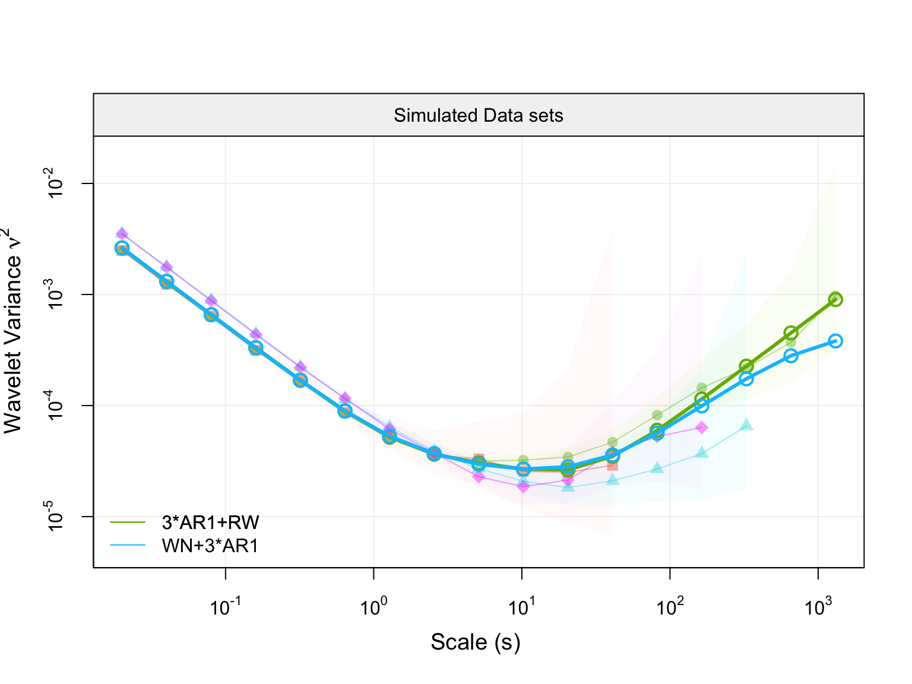
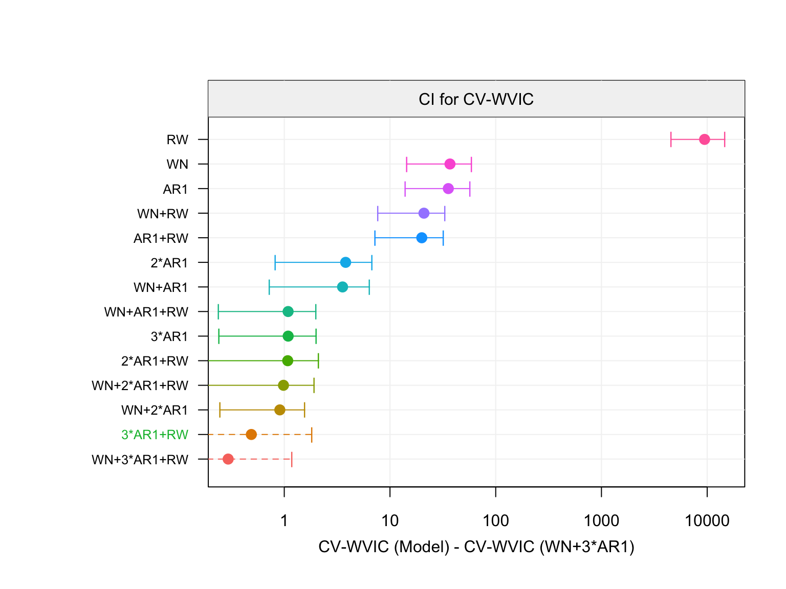

<!-- README.md is generated from README.Rmd. Please edit that file -->
[](https://travis-ci.org/SMAC-Group/classimu) [](http://www.repostatus.org/#active) [](https://www.gnu.org/licenses/gpl-3.0.en.html) [](https://cran.r-project.org/) [](https://cran.r-project.org/package=classimu) [](commits/develop) [](/commits/master)

`mgmwm` Overview <a href="https://smac-group.com/"></a>
=========================================================================================================================================

Multisignal GMWM (`mgmwm`) R package estimates parameters from multiple replicates coming from an IMU error signal, apply the near-stationarity test and select the nost approriate model 


To see what `mgmwm` is capable of, please refer to the "Vignettes" tabs above.

## IEEE/ION PLANS Monterey 2018 presentation

[A Two-Step Computationally Efficient Procedure for IMU Classification and Calibration](https://github.com/SMAC-Group/mgmwm/pdf/ieee-ion plans 2018 slides.pdf).


Install Instructions
--------------------
### Installing the package through GitHub

For users who are interested in having the latest developments, this option is ideal. Though, more dependancies are required to run a stable version of the package. Most importantly, users **must** have a compiler installed on their machine that is compatible with R (e.g. Clang).

*The setup to obtain the development version of `mgmwm` is platform dependent.*

### Requirements and Dependencies

**OS X**

Some users report the need to use X11 to suppress shared library errors. To install X11, visit [xquartz.org](http://www.xquartz.org/).

**Linux**

Both curl and libxml are required.

For **Debian** systems, enter the following in terminal:

``` bash
sudo apt-get install curl libcurl3 libcurl3-dev libxml2 libxml2-dev
```

For **RHEL** systems, enter the following in terminal:

``` bash
sudo yum install curl curl-devel libxml2 libxml2-dev
```

**All Systems**

The following R packages are also required. If you have made it this far, run the following code in an R session and you will be ready to use the devlopment version of `mgmwm`.

``` r
# Install dependencies
install.packages(c("RcppArmadillo","devtools","knitr","rmarkdown", "iterpc", "progress"))

# Install dependencies from github
devtools::install_github(c("SMAC-Group/simts", "SMAC-Group/wv", "SMAC-Group/gmwm"))

# Install the package from GitHub without Vignettes/User Guides
devtools::install_github("SMAC-Group/mgmwm")

# Install the package with Vignettes/User Guides 
devtools::install_github("SMAC-Group/mgmwm", build_vignettes = TRUE)
```
### Package capabilities example

**Create a M-IMU object**

In order to use the `mgmwm` package, one need to create a mimu object through the function `make_mimu`. An example on how to use this function is provided hereunder with simulated data:

```r
library(wv)
library(gmwm)
library(mgmwm)

# Set seed for reproducibility 
set.seed(2710)

# Define the differente sample size for simulated data
n1 = 10000
n2 = 500000
n3 = 100000
n4 = 50000

# Define the model for simulated data
model1 = AR1(.995, sigma2 = 1e-6) + WN(.005) + RW (1e-7)
model2 = AR1(.990, sigma2 = 1e-6) + WN(.007) + RW (1e-7)

# Generate 4 replicates coming from the above models
Wt =  gen_gts(n1, model1)
Xt =  gen_gts(n2, model1)
Yt =  gen_gts(n3, model2)
Zt =  gen_gts(n4, model2)

# Create the mimu object
mimu = make_mimu(Wt ,Xt, Yt, Zt, freq = 100, unit = "s", sensor.name = "Simulated Data sets", 
                 exp.name = c("today", "yesterday", "last friday","last tuesday" ))

# Plot the Empirical Walvelet Variance
plot(mimu)

```


**Estimates parameters values and plot function**

```r

# Specify the model which you want to estimate
model = 3*AR1() + WN() + RW ()

# Estimate the model with the mgmwm function
fit_1 = mgmwm(mimu, model, CI = T)

# Print summary of estimation (Parameters values and respective confidence intervals if computed)
summary(fit_1)

# Plot the Empirical Wavelet Variance with the one Implied by the parameters
plot(fit_1)
```


```r
# Plot the Empirical Wavelet Variance with the one Implied by the parameters with the contribution 
# of each individual processes
plot(fit_1, decomp = T)

```


**Select model and compare the selection criteria**

```r

# Compute the Wavelet Variance Information Criterion (WVIC) on all nested models
model_selection_1 = model_selection(mimu, model)

# Plot the selected model Implied WV
plot(model_selection_1)
```


```r

# Plot the equivalent model WV
plot(model_selection_1, type = "equivalent")
```

```r
# Plot the value of the WVIC for every nested model with their respective confidence intervals
plot(model_selection_1, type = "wvic_all")
```


The models in green are the equivalent models with the same or less models complexity, with respect to the number of parameters to estimate.
```r
# Plot the value of the WVIC for equivalent model(s) with their respective confidence intervals
plot(model_selection_1, type = "wvic_equivalent")

```


